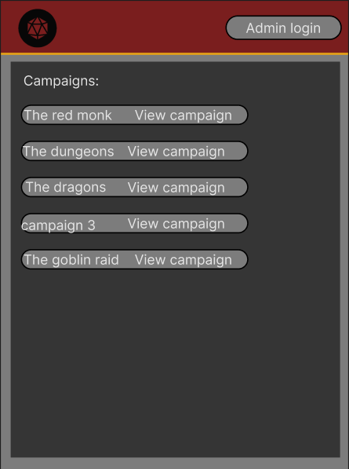

# Sprint 1 - A Working UI Prototype

## Sprint Goals

Develop a prototype that simulates the key functionality of the system, then test and refine it so that it can serve as the model for the next phase of development in Sprint 2.

[Figma](https://www.figma.com/) is used to develop the prototype.

---

## Initial Database Design

This database contains a list of campaigns with information about them which is connected to a list of players with contact information about them which is connected by a list of involved players

---

## UI 'Flow'

The first stage of prototyping was to explore how the UI might 'flow' between states, based on the required functionality.

This Figma demo shows the initial design for the UI 'flow':

<iframe style="border: 1px solid rgba(0, 0, 0, 0.1);" width="800" height="450" src="https://embed.figma.com/proto/1PY5ZQQj65byePlhvUfFLN/D-D?node-id=11-98&p=f&scaling=min-zoom&content-scaling=fixed&page-id=0%3A1&starting-point-node-id=11%3A98&embed-host=share" allowfullscreen></iframe>

### Testing

I took this to my end-user and got some feedback: 

> so far this will work well however a confirmation page for deleting campaigns would be good

### Changes / Improvements

I added a extra frame when the user clicks delete on a campaign they will be asked if they wish to proceed before it gets deleted

<iframe style="border: 1px solid rgba(0, 0, 0, 0.1);" width="800" height="450" src="https://embed.figma.com/proto/j3IUsdlrgKGXLjw3wtHZr1/D-D-v2?node-id=11-97&p=f&scaling=min-zoom&content-scaling=fixed&page-id=0%3A1&starting-point-node-id=11%3A98&embed-host=share" allowfullscreen></iframe>

---

## Initial UI Prototype

The next stage of prototyping was to develop the layout for each screen of the UI.

This Figma demo shows the initial layout design for the UI:

<iframe style="border: 1px solid rgba(0, 0, 0, 0.1);" width="800" height="450" src="https://embed.figma.com/proto/Dw3sWq1TbgyqyiiYT0pAbl/D-D-v3?node-id=4057-104&p=f&scaling=min-zoom&content-scaling=fixed&page-id=4057%3A13&embed-host=share" allowfullscreen></iframe>

### Testing

I took it to my end-user and they said its good but suggested some changes

### Changes / Improvements

Added outlines to the buttons and rounded the corners and added background boxes

<iframe style="border: 1px solid rgba(0, 0, 0, 0.1);" width="800" height="450" src="https://embed.figma.com/proto/Dw3sWq1TbgyqyiiYT0pAbl/D-D-v3?node-id=4057-104&p=f&scaling=min-zoom&content-scaling=fixed&page-id=4057%3A13&embed-host=share" allowfullscreen></iframe>

---

## Refined UI Prototype

Having established the layout of the UI screens, the prototype was refined visually, in terms of colour, fonts, etc.

This Figma demo shows the UI with refinements applied:

<iframe style="border: 1px solid rgba(0, 0, 0, 0.1);" width="800" height="450" src="https://embed.figma.com/proto/Dw3sWq1TbgyqyiiYT0pAbl/D-D-v3?node-id=11-98&p=f&scaling=min-zoom&content-scaling=fixed&page-id=0%3A1&starting-point-node-id=11%3A98&embed-host=share" allowfullscreen></iframe>

### Testing

I showed this design to my end user, their feedback was that the background is too dark

### Changes / Improvements

I lightened the background

---

## Sprint Review

This sprint went well it has moved the project to a more complete form that allows me and my end-user to get a taste of what the project will look like closer to 
completion. A key success point was getting good feedback from my end-user and being able to capitalize on it, the limitations of the figma free plan were something that didn't go well as I needed to use a screenshot for the final refined ui as I couldn't make anymore pages, designs or projects to show the changes in a live view.