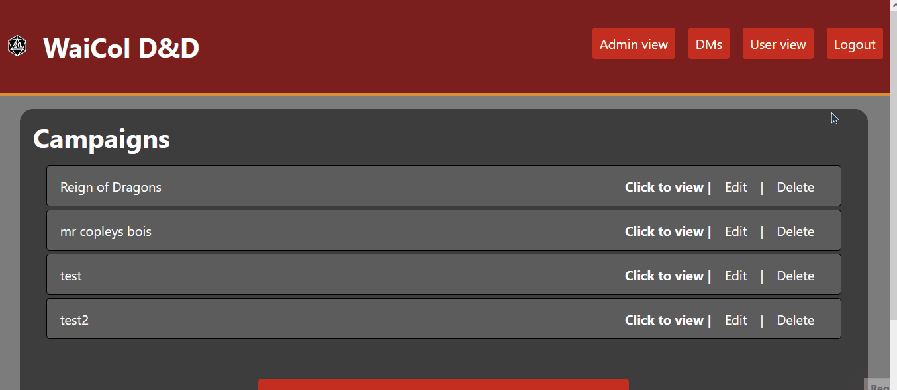
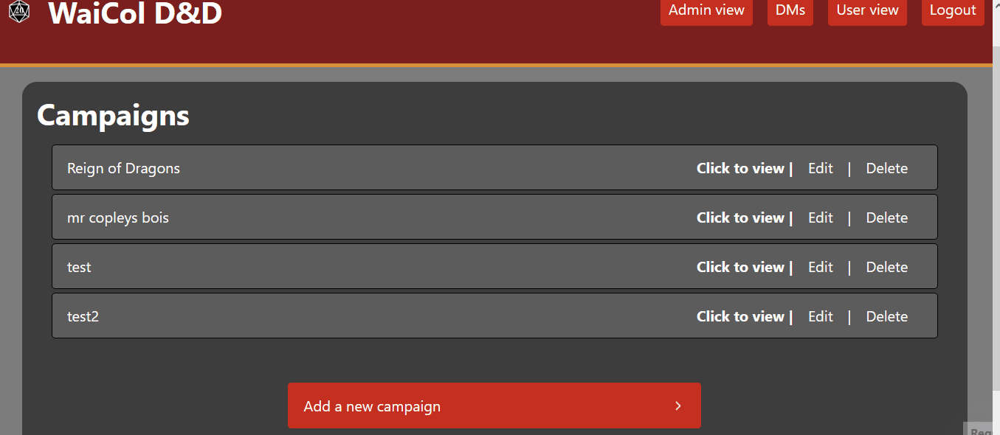
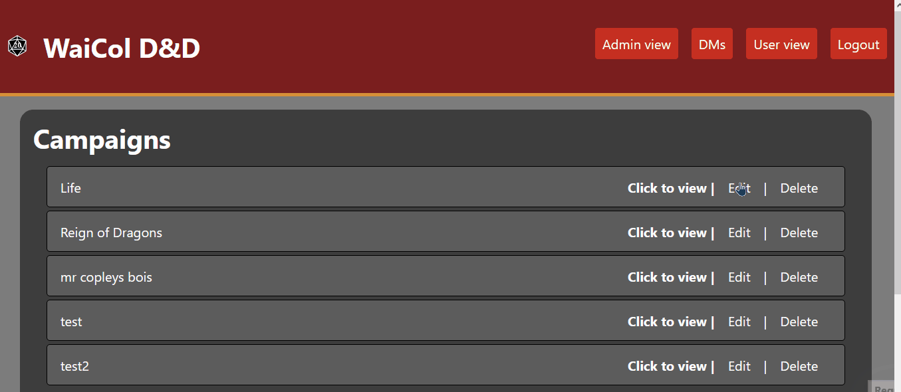
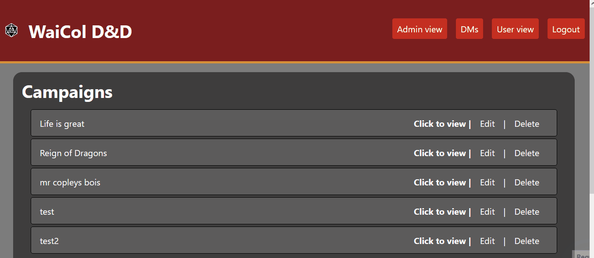
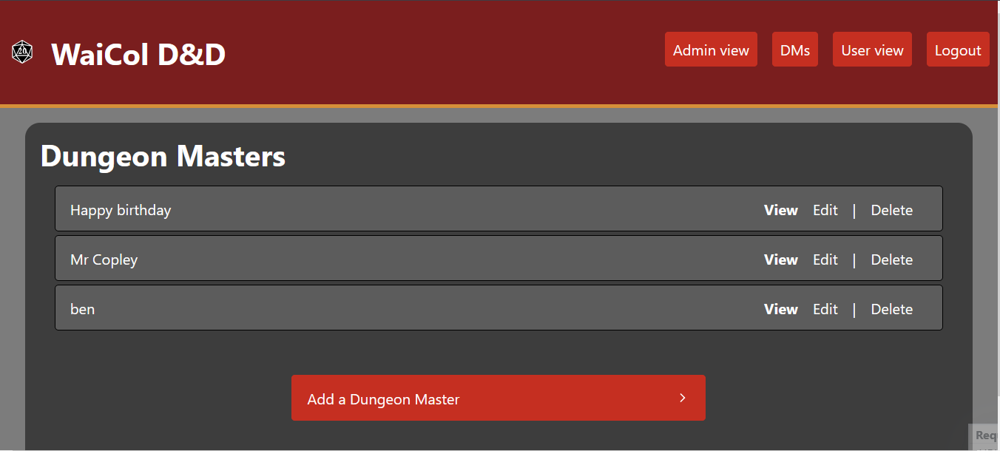
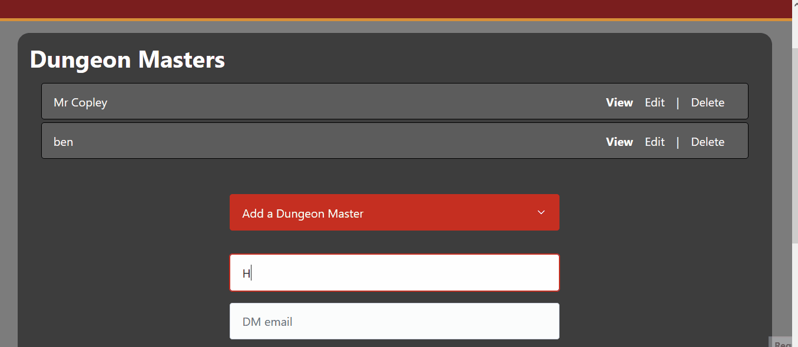
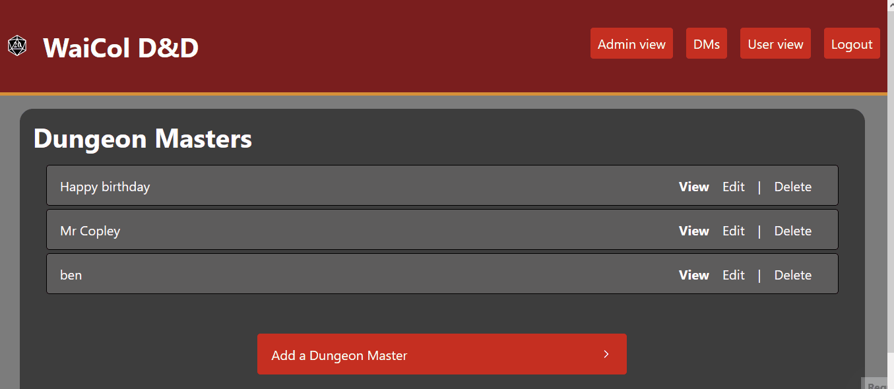
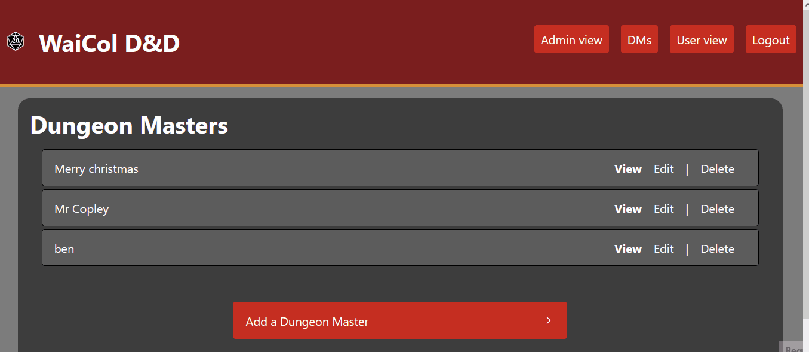
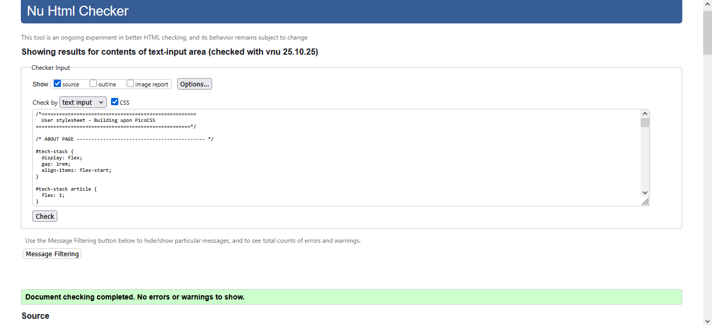

# Sprint 3 - A Refined and Complete System

## Sprint Goals

Develop the system until it is fully featured, with a refined UI and it satisfies the requirements. The system will be fully tested at this point.

---

## Updated Database Schema 

I have now realized that i never used second and third tables in my database which means I'm not using linked tables... Gonna have to fix that

changed from player details to dm details

will now need to add page for adding dm details on admin page

---

## Final Implementation

The web app is fully implemented with a refined UI:

---

## Testing User campaign listings

I tested the campaign listings when not logged in, I tested this by using the interfaces and getting my stakeholder to use my interface. 

### Changes / Improvements

Made the whole entry for each campaign the button to open the view and changed the text "view" to "click to view"

---

## Testing User campaign details

Testing campaign details, I tested this by using the interfaces and getting my stakeholder to use my interface. 

---

## Testing logging in as admin

Tested logging in as admin by logging in and getting end-user to log in

---

## Testing logging out from admin

Tested logging out from admin by logging out and getting end-user to log out

---

## Testing adding campaign

Tested adding a new campaign by adding a campaign using test data and getting my end-user to do the same

---

## Testing editing campaign

Tested editing a campaign by editing the name of a pre-existing campaign and getting my end-user to do the same

---

## Testing deleting campaign

Tested deleting campaign by deleting a pre-existing campaign and getting my end-user to do the same

---

## Testing DM view

Tested viewing DM list by going to the DM page and getting my end-user to test how easy it is to get specific information from it

---

## Testing adding DM

Tested adding a new DM by entering test data and getting end-user to do the same

---

## Testing editing DM

Tested editing a DM by changing the name of a pre-existing DM and getting my end-user to do the same

### Changes / Improvements

Changed DM discord to not be required as not all DMs will have discord 

---

## Testing deleting DM

Tested deleting a DM by deleting a pre-existing DM and getting my end-user to do the same

---

## Testing through validating code

I validated all of my HTML by loading up the page and copying the resultant sourcecode into https://validator.w3.org/#validate_by_input

### Changes / Improvements

Summarized list of changes:

User home:
- Used forward slash instead of backslash when calling images
- added alt text to logo 
- changed ids for repeated DB listings to classes 
User specific campaign view
- Added h2 title for article
Login page:
- removed space between attributes on cancel button
- removed unnecessary article tags
logout confirmation:
- changed cancel button from type="button" to role="button"
Admin home:
- changed ids for repeated DB listings to classes 
- validator advised that role="button" is not necessary on the summary element however I am using this for pico css styling so I did not change it
- Added a non-selectable option to the drop down input for choosing a DM so the highest id DM isn't selected by default
Campaign edit:
- Added a non-selectable option to the drop down input for choosing a DM so the highest id DM isn't selected by default
- validator advised to have a default non-selectable option for the DM dropdown however since this dropdown is already fulfilled by the DM from the DB this is not necessary
- Moved cancel button into the form to allow for flexbox use which stopped the errors caused by unclosed divs from my earlier attempts using a div from inside the form to outside it
Campaign delete confirmation:
- changed cancel button from type="button" to role="button"
Admin DMs view:
- changed ids for repeated DB listings to classes 
- validator advised that role="button" is not necessary on the summary element however I am using this for pico css styling so I did not change it
Specific DM view:
- removed stray paragraph tag
DM delete confirmation:
- changed cancel button from type="button" to role="button"
DM edit:
- moved cancel button into form and added relevant ids

---

I validated all of my CSS by copying styles.css into https://validator.w3.org/#validate_by_input

However there were no errors but I made sure to go through and clean up my CSS

## Sprint Review

This sprint went well the testing of the refined system let me work out any last kinks in the code and Validating all my work allowed me to follow convention and to reinforce my code further. Something that didn't go very well was me having little to change across sprint 2 to 3 as much of the needed changes were already done 
