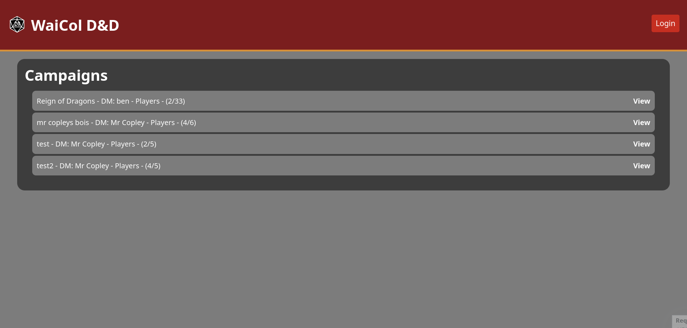
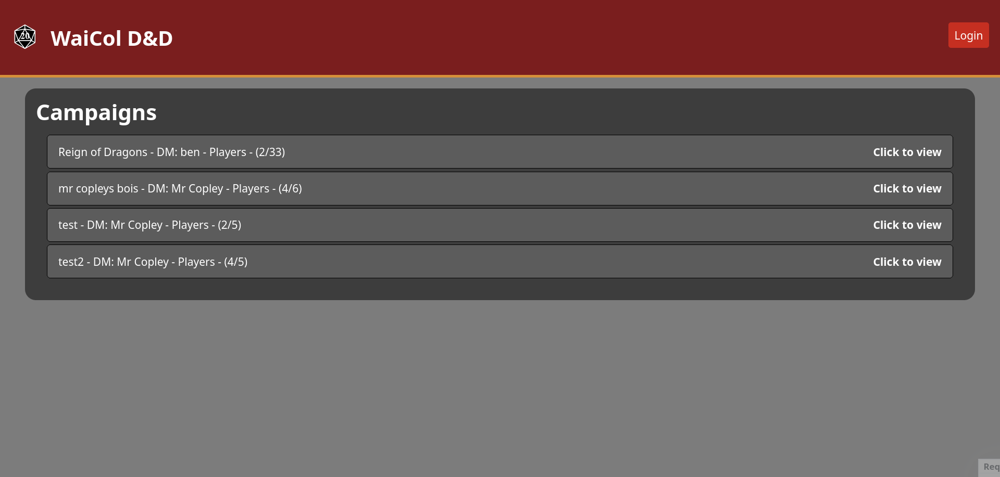
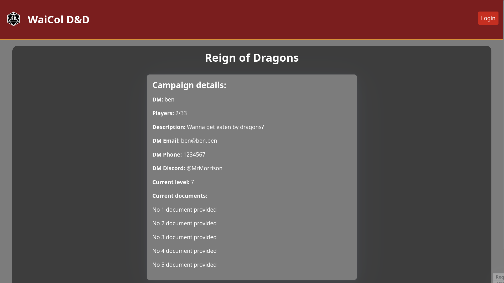
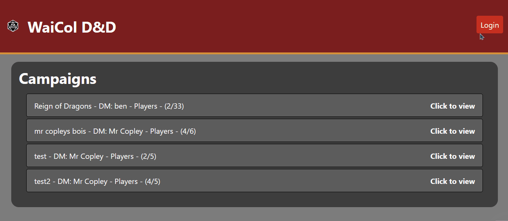
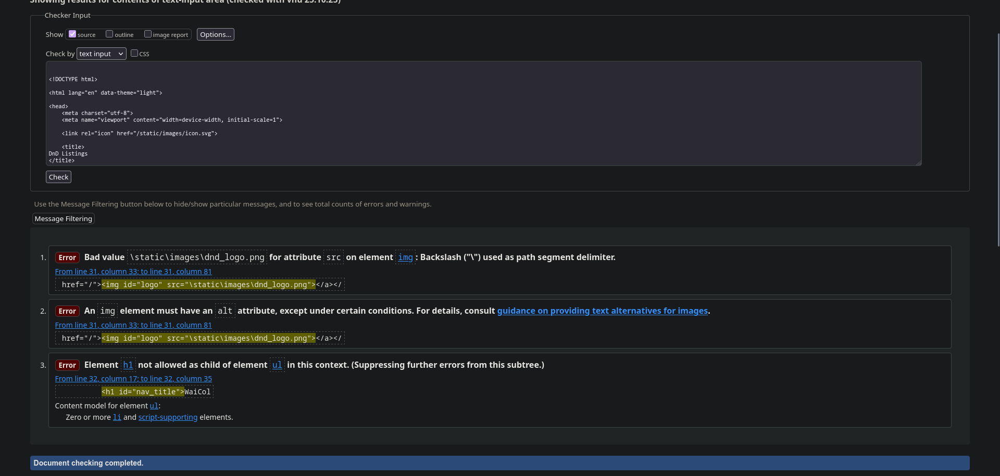

# Sprint 3 - A Refined and Complete System

## Sprint Goals

Develop the system until it is fully featured, with a refined UI and it satisfies the requirements. The system will be fully tested at this point.

---

## Updated Database Schema 

I have now realized that i never used second and third tables in my database which means I'm not using linked tables... Gonna have to fix that

changed from player details to dm details

will now need to add page for adding dm details on admin page

---

## Final Implementation

The web app is fully implemented with a refined UI:

---

## Testing User campaign listings

I tested the campaign listings when not logged in, I tested this by using the interfaces and getting my stakeholder to use my interface. 

### Changes / Improvements

Made the whole entry for each campaign the button to open the view and changed the text "view" to "click to view"

---

## Testing User campaign details

Testing campaign details, I tested this by using the interfaces and getting my stakeholder to use my interface. 

---

## Testing logging in as admin

Replace this text with notes about what you are testing, how you tested it, and the outcome of the testing

### Changes / Improvements

Replace this text with notes any improvements you made as a result of the testing.

**PLACE SCREENSHOTS AND/OR ANIMATED GIFS OF THE IMPROVED SYSTEM HERE**

---

## Testing logging out from admin

Replace this text with notes about what you are testing, how you tested it, and the outcome of the testing

**PLACE SCREENSHOTS AND/OR ANIMATED GIFS OF THE TESTING HERE**

### Changes / Improvements

Replace this text with notes any improvements you made as a result of the testing.

**PLACE SCREENSHOTS AND/OR ANIMATED GIFS OF THE IMPROVED SYSTEM HERE**

---

## Testing adding campaign

Replace this text with notes about what you are testing, how you tested it, and the outcome of the testing

**PLACE SCREENSHOTS AND/OR ANIMATED GIFS OF THE TESTING HERE**

### Changes / Improvements

Replace this text with notes any improvements you made as a result of the testing.

**PLACE SCREENSHOTS AND/OR ANIMATED GIFS OF THE IMPROVED SYSTEM HERE**

---

## Testing editing campaign

Replace this text with notes about what you are testing, how you tested it, and the outcome of the testing

**PLACE SCREENSHOTS AND/OR ANIMATED GIFS OF THE TESTING HERE**

### Changes / Improvements

Replace this text with notes any improvements you made as a result of the testing.

**PLACE SCREENSHOTS AND/OR ANIMATED GIFS OF THE IMPROVED SYSTEM HERE**

---

## Testing deleting campaign

Replace this text with notes about what you are testing, how you tested it, and the outcome of the testing

**PLACE SCREENSHOTS AND/OR ANIMATED GIFS OF THE TESTING HERE**

### Changes / Improvements

Replace this text with notes any improvements you made as a result of the testing.

**PLACE SCREENSHOTS AND/OR ANIMATED GIFS OF THE IMPROVED SYSTEM HERE**

---

## Testing DM view

Replace this text with notes about what you are testing, how you tested it, and the outcome of the testing

**PLACE SCREENSHOTS AND/OR ANIMATED GIFS OF THE TESTING HERE**

### Changes / Improvements

Replace this text with notes any improvements you made as a result of the testing.

**PLACE SCREENSHOTS AND/OR ANIMATED GIFS OF THE IMPROVED SYSTEM HERE**

---

## Testing adding DM

Replace this text with notes about what you are testing, how you tested it, and the outcome of the testing

**PLACE SCREENSHOTS AND/OR ANIMATED GIFS OF THE TESTING HERE**

### Changes / Improvements

Replace this text with notes any improvements you made as a result of the testing.

**PLACE SCREENSHOTS AND/OR ANIMATED GIFS OF THE IMPROVED SYSTEM HERE**

---

## Testing editing DM

Replace this text with notes about what you are testing, how you tested it, and the outcome of the testing

**PLACE SCREENSHOTS AND/OR ANIMATED GIFS OF THE TESTING HERE**

### Changes / Improvements

Replace this text with notes any improvements you made as a result of the testing.

**PLACE SCREENSHOTS AND/OR ANIMATED GIFS OF THE IMPROVED SYSTEM HERE**

---

## Testing deleting campaign

Replace this text with notes about what you are testing, how you tested it, and the outcome of the testing

**PLACE SCREENSHOTS AND/OR ANIMATED GIFS OF THE TESTING HERE**

### Changes / Improvements

Replace this text with notes any improvements you made as a result of the testing.

**PLACE SCREENSHOTS AND/OR ANIMATED GIFS OF THE IMPROVED SYSTEM HERE**

---

## Testing through validating code

I validated all of my HTML by loading up the page and copying the resultant sourcecode

### Changes / Improvements

Summarized list of changes:

User home:
- Used forward slash instead of backslash when calling images
- added alt text to logo 
- changed ids for repeated DB listings to classes 
User specific campaign view
- Added h2 title for article
Login page:
- removed space between attributes on cancel button
- removed unnecessary article tags
logout confirmation:
- changed cancel button from type="button" to role="button"
Admin home:
- changed ids for repeated DB listings to classes 
- validator advised that role="button" is not necessary on the summary element however I am using this for pico css styling so I did not change it
- Added a non-selectable option to the drop down input for choosing a DM so the highest id DM isn't selected by default
Campaign edit:
- Added a non-selectable option to the drop down input for choosing a DM so the highest id DM isn't selected by default
- validator advised to have a default non-selectable option for the DM dropdown however since this dropdown is already fulfilled by the DM from the DB this is not necessary
- Moved cancel button into the form to allow for flexbox use which stopped the errors caused by unclosed divs from my earlier attempts using a div from inside the form to outside it
Campaign delete confirmation:
- changed cancel button from type="button" to role="button"
Admin DMs view:
- changed ids for repeated DB listings to classes 
- validator advised that role="button" is not necessary on the summary element however I am using this for pico css styling so I did not change it
Specific DM view:
- removed stray paragraph tag
DM delete confirmation:
- changed cancel button from type="button" to role="button"
DM edit:
- moved cancel button into form and added relevant ids

---

## Sprint Review

Replace this text with a statement about how the sprint has moved the project forward - key success point, any things that didn't go so well, etc.

