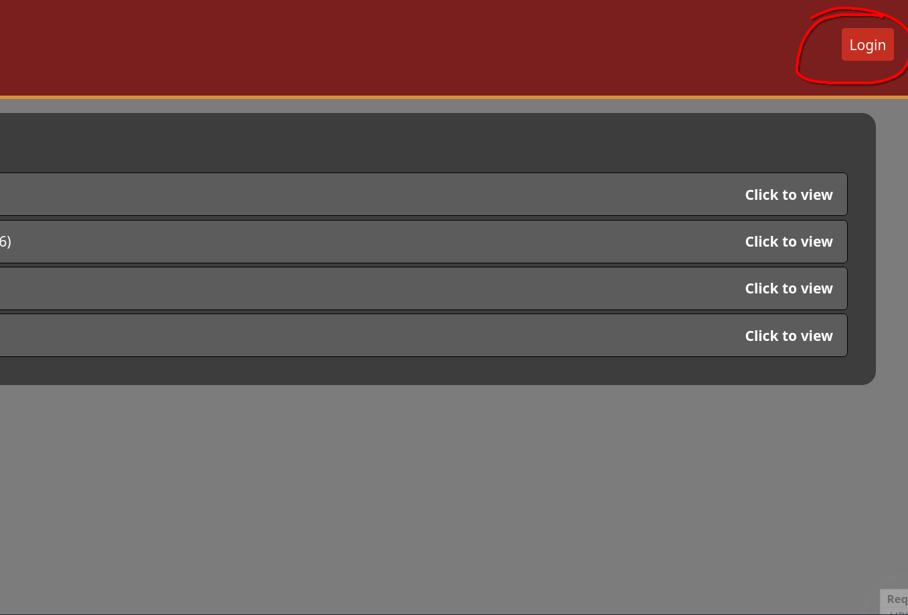
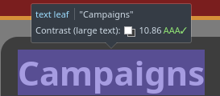
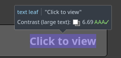

# Project Review

## Addressing Relevant Implications

### Usability

I ensured thorough testing of each feature and made a conscious effort to simplify where I could. An example of this is following design conventions such as putting the login/logout button on the top right and having a navigation bar across the top of the interface

### Functionality

I ensured that I tested functionality regularly and tried to streamline actions the user would take and ensure that I found and patched as many bugs as I could such as when the back buttons wouldn't work due to a coding error

Check previous sprints for testing

### End-user 

I made sure to communicate with my end-users and get feedback on the design and functionality and also ensured that the interface was simple to understand and use so it can cater to all ages and technical abilities and I also went through a prototyping phase and liaised with my end-users during this process to improve the final product

Check previous sprints for evidence especially sprint 1 for prototyping

### Aesthetic

I went through a prototyping phase for the design of the website while getting feedback from the end-user on the layout and colour scheme to make sure it would work for my end-users and I also made sure to use colour schemes that fit the theme of D&D which makes it fit my end-users better

Check previous sprints for evidence especially sprint 1 for prototyping

red and gold colour scheme

### Accessibility

I made sure to periodically check the readability of text and the contrast of colours in the interface I also made sure to not make any text too small and made buttons large where possible so its easy to find and click them.

---

## Overall Review

I think overall the project went well however documentation could have been managed better. It's far easier for me to launch into making a interface and making documentation would occasionally fall to the wayside. Testing and trialing positively impacted the project as it allowed me to go from a basic prototype and idea to a far more complete and adapt interface than if I had just made the interface in one go without any external feedback or testing. Next time I would make sure to document as I go and to make sure I actually use the other 2 thirds of my database so I don't have to rush to remake the interface in order to use linked tables in my database.